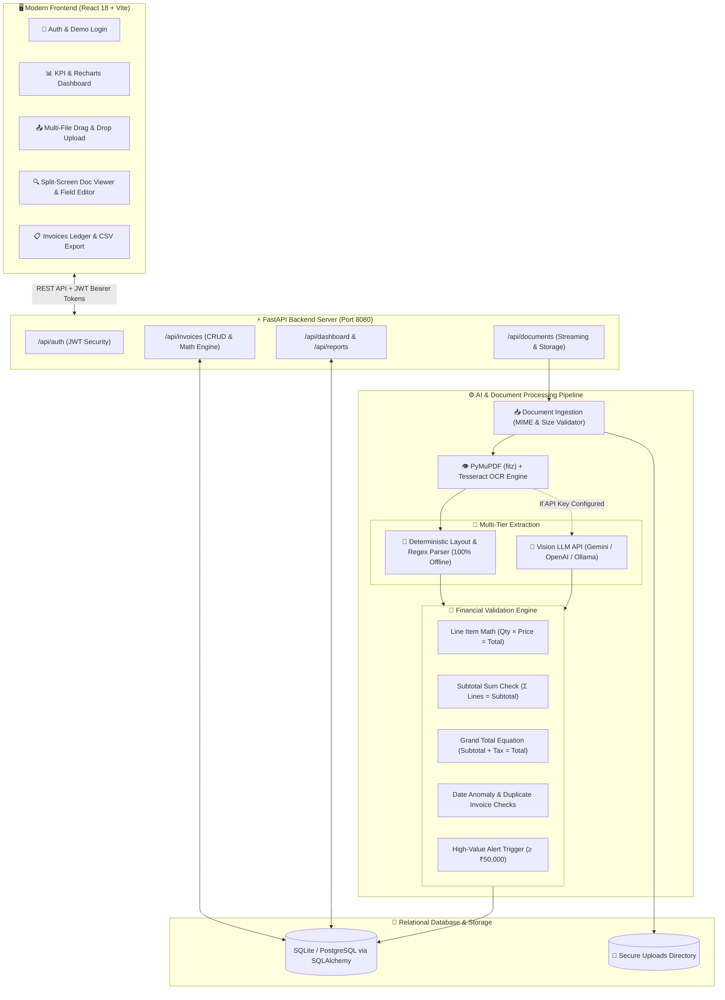

# ⚡ AI Document & Invoice Processing Agent (ApexInvoice AI)

A complete, professional, production-ready SaaS application that reads uploaded business invoices & receipts in **PDF, JPG, JPEG, and PNG** formats, extracts structured key-value data with **OCR & Vision AI**, executes **mathematical financial cross-checks**, flags discrepancies & policy violations, stores records in an **ACID SQLite database**, and provides a rich modern dashboard for human-in-the-loop review, editing, and CSV reporting.

---

## 🌟 Key Features

1. **📑 Multi-Format Ingestion & OCR Pipeline**:
   - Ingests single & multi-page **PDFs** using **PyMuPDF (`fitz`)**.
   - Ingests scanned images (**PNG, JPG, JPEG, WEBP**) with **Pillow (`PIL`)** contrast enhancement & **Tesseract OCR**.
   - Maximum upload limit of 10 MB per document with MIME type & file format verification.

2. **🧠 Multi-Tier AI Document Extraction**:
   - **Deterministic Financial Rule & Tabular Layout Parser**: Deep regex, layout geometry, column reconstruction, and tax calculators. Works **100% offline out-of-the-box with zero API keys required**.
   - **Vision LLM Integration (Optional)**: Plug-and-play support for **Google Gemini 1.5 Flash**, **OpenAI GPT-4o Mini**, or **Local Ollama (LLaVA)** via `.env` or the Settings UI.
   - Extracts: Vendor Name, Address, GSTIN / Tax ID, Phone, Email, Customer Name, Invoice #, PO #, Issue Date, Due Date, Currency (default ₹/INR), Line Items (Desc, Qty, Unit Price, Tax, Line Total), Subtotal, Tax Amount, Shipping, Discounts, and Grand Total.

3. **🧮 Comprehensive Financial Validation Matrix**:
   - **Line Math Integrity**: Validates $\text{Qty} \times \text{Unit Price} == \text{Line Total}$.
   - **Subtotal Summation**: Cross-checks that $\sum \text{Line Totals} == \text{Subtotal}$.
   - **Grand Total Equation**: Validates $\text{Subtotal} + \text{Tax} + \text{Shipping} - \text{Discount} == \text{Grand Total}$.
   - **Date Logic**: Flags if $\text{Due Date} < \text{Invoice Date}$.
   - **Duplicate Invoice Detection**: Flags duplicate invoice numbers for matching vendors.
   - **High-Value Threshold Alerts**: Flags invoices exceeding the threshold (e.g., $\ge \text{₹}50,000$).
   - Status classifications: `APPROVED` (100% valid), `NEEDS_REVIEW` (missing field / high-value), `FLAGGED` (critical math discrepancy), `REJECTED`.

4. **🔍 Interactive Split-Screen Human-in-the-Loop Reviewer**:
   - **Left Column**: High-resolution document viewport (PDF/image) with Zoom In, Zoom Out, Reset, and external open controls.
   - **Right Column**: Live editable fields with validation badges (`Valid`, `Needs Review`, `Mismatch`, `Missing Information`).
   - **Line Items Table Editor**: Add items, delete items, update quantities or unit prices with live automatic recalculation.
   - **Actions**: Save Changes, Approve Invoice, Mark for Review, Reprocess Document.

5. **📊 Executive Dashboard & Analytics**:
   - Real-time KPIs: Total Processed, Validated Count, Needs Review Count, Total Invoiced Value (₹/INR default).
   - Recharts Visualizations: Cumulative Processing Timeline, Status Distribution Donut, Top Vendor Spend Breakdown.
   - Live in-app notifications center.

6. **📁 Reports & CSV Exports**:
   - Filter by date range and status.
   - Export full **Invoices CSV** (compatible with Excel, Google Sheets, ERPs).
   - Export itemized **Line Items CSV**.

---

## 🏗️ System Architecture



---

## 🛠️ Technology Stack

- **Backend**: Python 3.10+, FastAPI, SQLAlchemy, SQLite, Pydantic v2, PyMuPDF (`fitz`), Pillow, PyTesseract, ReportLab, PyJWT, Passlib (Bcrypt).
- **Frontend**: React 18, Vite, Lucide Icons, Recharts, Custom SaaS CSS Design System.

---

## 🚀 Quick Start Guide

### 🔑 Demo Login Credentials
For local development and testing, use the pre-configured demo account:
- **Email**: `demo@antigravity.ai`
- **Password**: `demo1234`
*(You can also register a new account on the login screen or click "Quick Demo Access".)*

---

### Windows (PowerShell) Instructions

#### 1. Backend Setup
Open a PowerShell terminal:
```powershell
# Navigate to the backend directory
cd backend

# Create and activate a virtual environment
python -m venv venv
.\venv\Scripts\Activate.ps1

# Install dependencies
pip install -r requirements.txt

# (Optional) Copy .env.example to .env
Copy-Item .env.example .env

# Run the FastAPI backend server (Runs on port 8000)
python run.py
```

#### 2. Frontend Setup
Open a **second** PowerShell terminal:
```powershell
# Navigate to the frontend directory
cd frontend

# Install Node dependencies
npm install

# Start the Vite React development server (Runs on port 5173)
npm run dev
```

Open your browser at **`http://localhost:5173`**.

---

### macOS / Linux Instructions

#### 1. Backend Setup
In your first terminal:
```bash
cd backend
python3 -m venv venv
source venv/bin/activate
pip install -r requirements.txt
python3 run.py
```

#### 2. Frontend Setup
In your second terminal:
```bash
cd frontend
npm install
npm run dev
```

Open **`http://localhost:5173`** (or **`http://127.0.0.1:8000`** if using the unified production build).

---

## 🧪 1-Click Testing with Built-in Preset Scenarios

1. Log in to the application at `http://localhost:5173`.
2. Click **"Load Test Invoices"** in the top navigation bar (or on the Upload page).
3. The system will automatically generate and process 4 realistic test PDF invoices:
   - **Sample 1: IT Services (₹92,630)** $\rightarrow$ **`APPROVED`** (100% valid GST & math match).
   - **Sample 2: High-Value Server Compute Rack (₹6,48,720)** $\rightarrow$ **`NEEDS_REVIEW`** (Triggers high-value alert $\ge \text{₹}50,000$).
   - **Sample 3: Office Furniture Discrepancy (₹65,000)** $\rightarrow$ **`FLAGGED`** (Line math mismatch and grand total calculation error detected).
   - **Sample 4: Security Audit Date Issue (₹41,300)** $\rightarrow$ **`NEEDS_REVIEW`** (Due date precedes billing date).
4. Navigate to **All Invoices** or **Needs Review** and click **Review** to inspect side-by-side.

---

## ⚙️ Optional AI LLM Vision Configuration

The system runs **100% offline without requiring any LLM API key**. If you want to enable Vision LLM extraction for complex or handwritten invoices:

1. Open `backend/.env` (or go to **Settings** in the Web UI).
2. Set your provider and API key:
```env
LLM_PROVIDER=gemini       # Options: 'heuristic', 'gemini', 'openai', 'ollama'
GEMINI_API_KEY=AIzaSy...  # Your Google Gemini API Key
OPENAI_API_KEY=sk-proj... # Your OpenAI API Key
```
3. Save changes. The backend will automatically route complex documents to the vision model with automatic rule-based fallback.

---

## 🧪 Running Automated Tests

Run backend unit tests:
```bash
cd backend
python3 -m pytest tests/
```
All tests verify authentication, document processing, and financial validation logic.

---

## 📁 Project Structure

```
├── backend/
│   ├── app/
│   │   ├── main.py             # FastAPI entrypoint & router registration
│   │   ├── config.py           # Configuration & directory paths
│   │   ├── database.py         # SQLAlchemy engine, session maker & init
│   │   ├── models.py           # SQLAlchemy database models
│   │   ├── schemas.py          # Pydantic v2 schemas
│   │   ├── routes/
│   │   │   ├── auth.py         # Registration & JWT login
│   │   │   ├── documents.py    # Document upload & preview streaming
│   │   │   ├── invoices.py     # Invoices CRUD, live review & approvals
│   │   │   ├── dashboard.py    # KPIs & Recharts analytics data
│   │   │   ├── reports.py      # Monthly breakdown & CSV exports
│   │   │   ├── notifications.py# In-app notifications
│   │   │   └── settings.py     # User preferences & API key configuration
│   │   ├── services/
│   │   │   ├── ocr_service.py  # PyMuPDF & Tesseract OCR engine
│   │   │   ├── extraction_service.py # Multi-tier Vision LLM & rule engine
│   │   │   ├── validation_service.py # Financial cross-checks & discrepancy matrix
│   │   │   └── notification_service.py # Webhooks & in-app alerts
│   │   └── utils/
│   │       ├── security.py     # Password hashing & JWT tokens
│   │       └── file_validation.py # Size & MIME verification
│   ├── tests/                  # Pytest unit test suite
│   ├── uploads/                # Document storage directory
│   ├── requirements.txt        # Backend dependencies
│   ├── .env.example            # Environment variables template
│   └── run.py                  # Backend server runner
├── frontend/
│   ├── src/
│   │   ├── components/         # StatusBadge, Navbar, Sidebar, Modals
│   │   ├── context/            # AuthContext
│   │   ├── layouts/            # DashboardLayout
│   │   ├── pages/              # Login, Dashboard, Upload, Invoices, Review, Reports, Settings
│   │   ├── services/           # API client
│   │   ├── styles/             # Modern SaaS design system CSS
│   │   ├── App.jsx             # Main router
│   │   └── main.jsx            # Entry point
│   ├── package.json            # Frontend dependencies
│   └── vite.config.js          # Vite configuration & proxy
├── sample_documents/           # Sample PDF test invoices
└── README.md                   # Documentation
```
